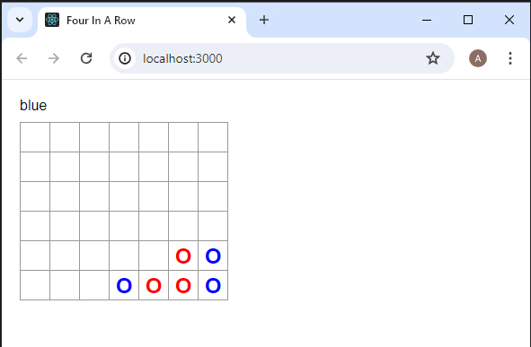
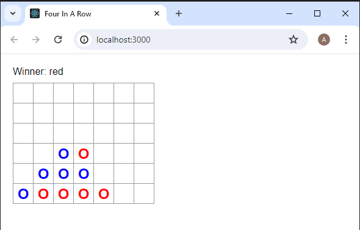

This is a react project that I was using to learn the basics of react. This project was made entirely by me.

One of the technical problems with this project was managing the click handlers for the board. Since the board is
created through a map function I had to rearrange my code to populate each "column" of the four squard board
with the same click handler.

