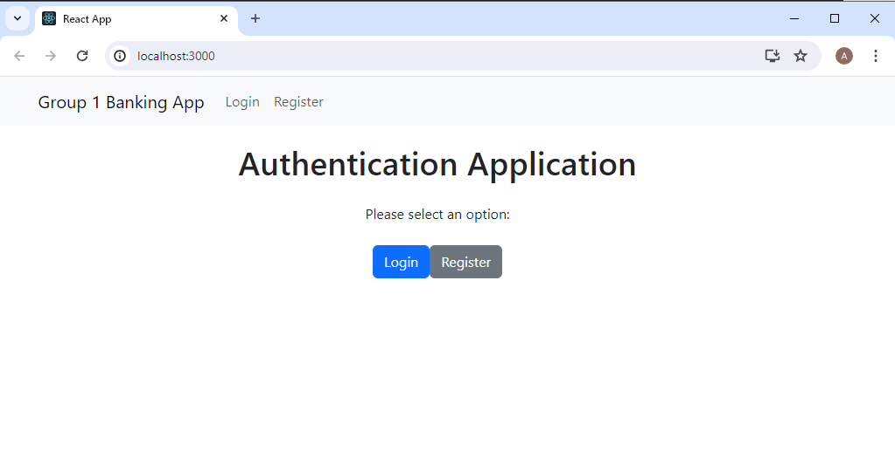
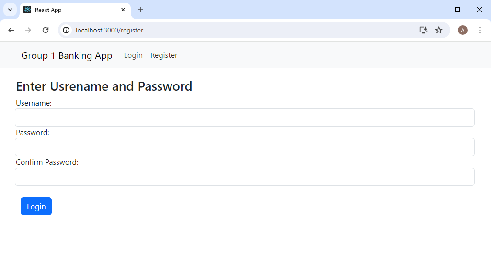
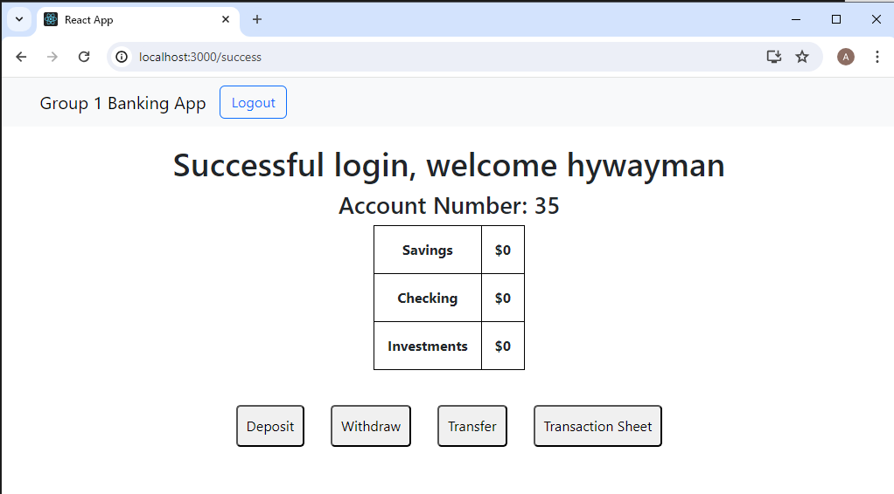
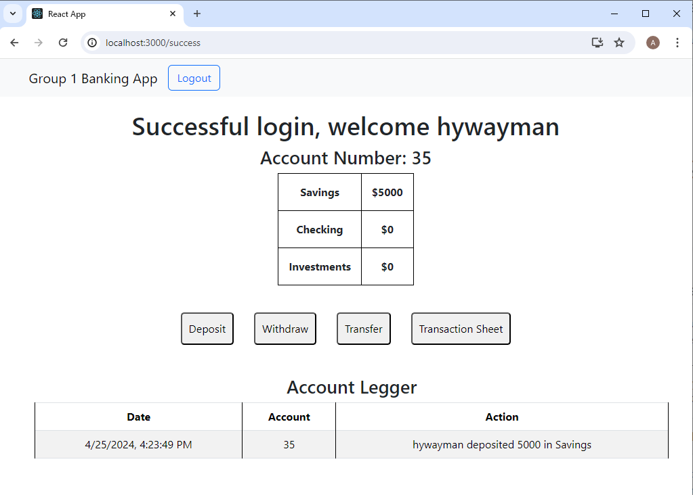

This is a group project to create a small banking application. The front end was created with React. The back end server is running an express server with a connection to a mongodb database for data storage.

To start off we created a main window page. This page allows the user to either create an account or to log in. The users password is stored in the mongodb database and is saved through a hashing algorithm with a salt value for secure storage.

The registration page allows new users to create a new account. No duplicate usernames are allowed. This data is sent to the express backend where the data is validated and saved to a mongodb database.

Once the user is logged in the front end requests their account data to display. The user can then deposit, withdraw, and transfer funds as they see fit. When an action is completed a legger is created and saved to act as a history of the accounts actions.

Here we see the legger sheet that was requested from the backend and displayed by the front end.

The biggest issue we had with this project was loading the users data on load. Luckily we figured out that a react useEffect was the perfect way to keep requesting the users data whenever an action was submitted to the backend.
