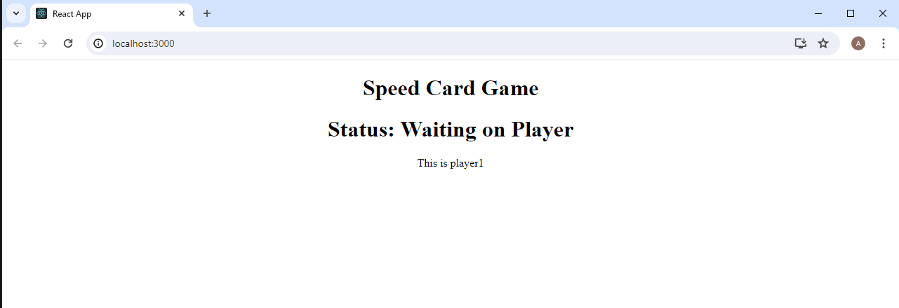
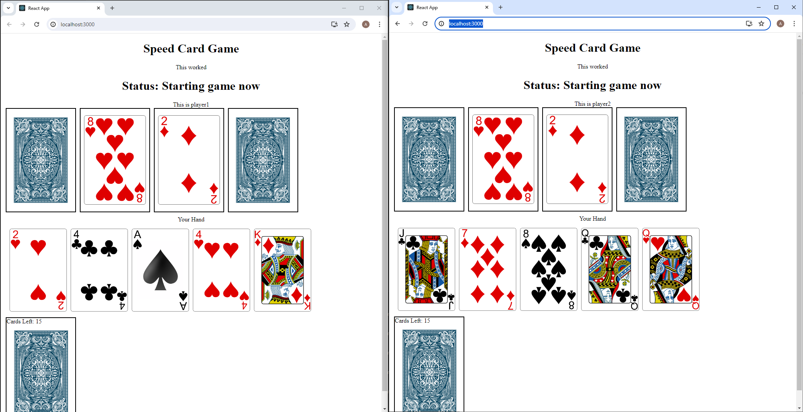
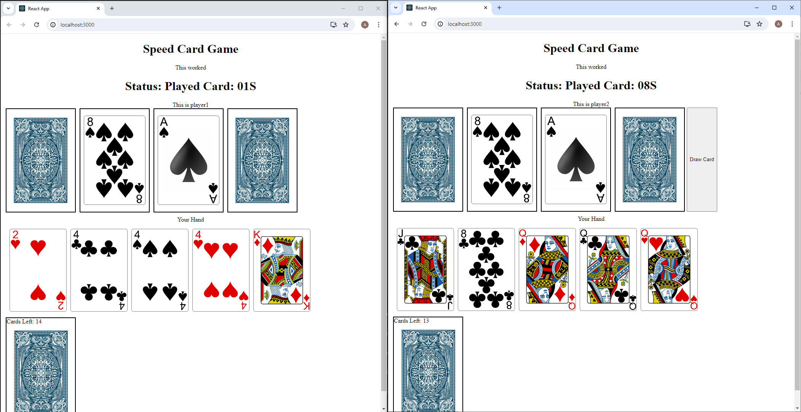
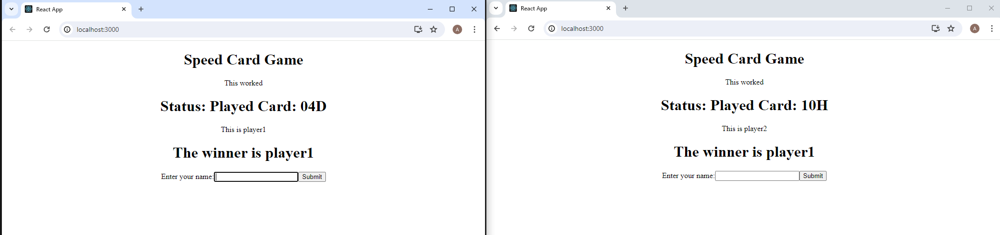

This project is a group speed game. For this project we used React to create an interactive frontend. We also used Socket.io to create a backend with a mongodb connection for data storage. This project uses Socket.io to create websockets between the user and server, this allows the front end to react dynamically to any actions submitted by their opponent in another browser.

What happens first is the first client connects to the server. The server repsonds with a waiting message letting the client know that their is not an available player to play with yet. Once another client connects the game proceeds to its next phase.

Once the two players are connected, the backend creates the gamestate issues cards for each player and a play area. This gamestate is then transmitted from the server to each client for play to begin. React DND(Drag and Drop) was used to make the cards more interactive for the clients.

When the client plays a card, a call is made to the backend which checks the validity of the play. And if the play is allowed the server emits a new gamestate to both connected clients. If the play is invalid the server responds with an error message and resends the same gamestate.

Once a victory is acheived the clients enter their names and their data is saved into a database.

For this particular project I was in charge of a lot of the front end and communication with the backend. Our biggest problem in this project was making sure that each person knew what messages would be sent across the sockets and what data would be sent by the sockets. A lot of our troubleshooting ended up being comparing what the backend was sending to the cleint and vice versa.
